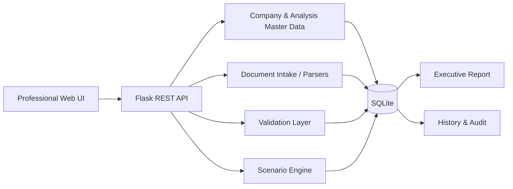

# Tax Regime Scenario Analyzer — Tax Strategy Workspace

A full-stack Flask portfolio application that models a **real accounting-process improvement workflow**: company master data, 12-month financial inputs, document intake, validation, three-regime tax comparison, executive reporting, and complete history/auditability.

This repository is an **anonymized public rebuild inspired by a real process-improvement engagement in an accounting environment**. It contains **no client data, proprietary files, credentials, real CNPJs, or confidential business rules**.

## Why this is more than a calculator

Tax-planning work is rarely blocked by one formula. The operational challenge is usually fragmented evidence, inconsistent spreadsheets, missing fiscal context, manual reconciliations, and a lack of traceability around what was calculated and when.

This project treats that as a workflow problem:

**Master data → Evidence → 12-month financial structure → Validation → Scenario engine → Executive report → History / audit**

The interface is intentionally designed as a B2B internal platform rather than a single-form demo.

## Product modules

- **Executive Dashboard** — annual revenue, baseline tax, evidence, validations, 12-month revenue evolution, activity mix, scenario benchmark, readiness, audit activity, executive signal.
- **Company Registry** — legal/trade name, synthetic identifier, CNAE/activity, municipality/state, current regime, service annex, ISS/ICMS assumptions, internal notes.
- **Financial Workspace** — editable 12-month matrix with commerce, industry, services, payroll, costs, expenses, current tax paid, coverage checks, operating margin and Factor R proxy.
- **Data Sources** — upload CSV, XLSX, XML, TXT or PDF; store parser/status/timestamp/SHA-256; recognized monthly files can populate the financial matrix.
- **Validation Center** — blocking/high/medium checks with human review status and traceability.
- **Tax Analysis** — side-by-side Simples Nacional, Lucro Presumido and Lucro Real, with effective rates, tax component breakdown, assumptions, operating profile and scenario deltas.
- **Executive Report** — print-ready report that can be saved as PDF directly from the browser.
- **History & Audit** — simulation versions, document history and user/workflow audit events.
- **Rules & Sources** — calculation-governance register that clearly distinguishes illustrative software assumptions from professional fiscal validation.

## Stack

- Python 3.11+
- Flask 3
- SQLite
- OpenPyXL for spreadsheet intake
- Vanilla JavaScript
- Responsive HTML/CSS
- Gunicorn
- Pytest
- GitHub Actions
- Railway-ready deployment

## Architecture



See `docs/architecture.md` for the complete application flow.

## Scenario-engine scope

The public version deliberately uses **illustrative assumptions** to demonstrate software architecture, data modeling, transparent calculations and review workflow.

It includes:

- a schedule-based Simples Nacional proxy;
- service-annex selection using a Factor R proxy;
- activity-based Lucro Presumido bases;
- profit-based Lucro Real proxy;
- IRPJ, surcharge, CSLL, PIS, COFINS, ISS and ICMS proxy components;
- effective-rate calculations;
- current-tax baseline comparison;
- lowest/highest modeled scenario spread.

It intentionally does **not** represent a production-grade fiscal engine. Eligibility, credits, withholdings, sector rules, additions/exclusions, special regimes, legislation changes and professional judgments are outside the public demo scope.

> **Not tax advice.** The application is a software/data portfolio project and requires human professional validation for any real-world use.

## Synthetic demo data

The first run automatically seeds three fictional companies with different profiles:

- a service business focused on Factor R and service annex review;
- a mixed commerce/services profile;
- an industrial profile with higher revenue and cost structure.

Each seeded analysis contains a 12-month synthetic dataset and sample evidence/history so the deployed interface is useful immediately instead of opening as an empty shell.

## Run locally

```bash
git clone https://github.com/oandremassa/tax-regime-scenario-analyzer.git
cd tax-regime-scenario-analyzer

python3 -m venv .venv
source .venv/bin/activate
# Windows: .venv\Scripts\activate

pip install -r requirements.txt
python run.py
```

Open `http://127.0.0.1:5000`.

## Railway deployment

The repository includes both a `Procfile` and `railway.json`.

Railway start command:

```bash
gunicorn run:app --bind 0.0.0.0:$PORT --workers 2 --threads 4 --timeout 120
```

Health check:

```text
/api/health
```

SQLite is appropriate for this public demo. Railway container storage is ephemeral unless a volume is attached; the synthetic data reseeds on a fresh database. A production evolution would normally use PostgreSQL.

## Document intake

Supported demo paths:

| Type | Behavior |
|---|---|
| CSV | Detects a recognized monthly financial matrix and imports it |
| XLSX/XLSM | Searches worksheets for a recognized monthly matrix |
| XML | Extracts generic/NF-e-like metadata and values |
| TXT/DAT | Detects PGDAS-like reference fields when present |
| PDF | Stored as evidence for manual review |

Use `data/sample_monthly_financials.csv`, `data/sample_pgdas_like.txt`, and `data/sample_nfe_like.xml` for testing.

## REST API

Core endpoints include:

```text
GET    /api/health
GET    /api/bootstrap
GET    /api/dashboard
GET    /api/companies
POST   /api/companies
GET    /api/companies/<id>
PATCH  /api/companies/<id>
POST   /api/analyses
GET    /api/analyses/<id>
PUT    /api/analyses/<id>/monthly
POST   /api/upload
GET    /api/analyses/<id>/validations
PATCH  /api/validations/<id>
POST   /api/simulate
GET    /api/simulations/<id>
GET    /api/history/<company_id>
GET    /api/rules/status
```

## Repository structure

```text
.
├── app/
│   ├── __init__.py
│   ├── db.py
│   ├── engine.py
│   ├── parsers.py
│   ├── routes.py
│   ├── schema.sql
│   ├── seed.py
│   ├── static/
│   └── templates/
├── data/
├── docs/
├── tests/
├── .github/workflows/
├── Dockerfile
├── Procfile
├── railway.json
├── requirements.txt
└── run.py
```

## Engineering choices

**Human-in-the-loop by design.** A mathematically lower estimate is not silently turned into a legal recommendation. Blocking validations and model assumptions remain visible.

**Traceability over black-box automation.** Simulations preserve engine version, results, timestamps and audit history.

**Structured year view.** The workflow is centered on a 12-month fiscal picture rather than a single monthly number.

**Anonymization by reconstruction.** The public repository retains the engineering challenge and workflow depth while removing real clients, client documents, branding, confidential data and internal credentials.

**Small dependency surface.** The UI is vanilla JS/CSS and the backend remains easy to clone, inspect and explain in an interview.

## Tests

```bash
pytest -q
```

GitHub Actions runs the test suite on Python 3.11 and 3.12.

## Suggested portfolio framing

> Built an end-to-end Flask workflow for accounting-process improvement, combining structured 12-month financial data, document ingestion, human validation, scenario analysis, executive reporting and auditability. Public repository uses fully synthetic data and an illustrative calculation engine.

## License

MIT.
